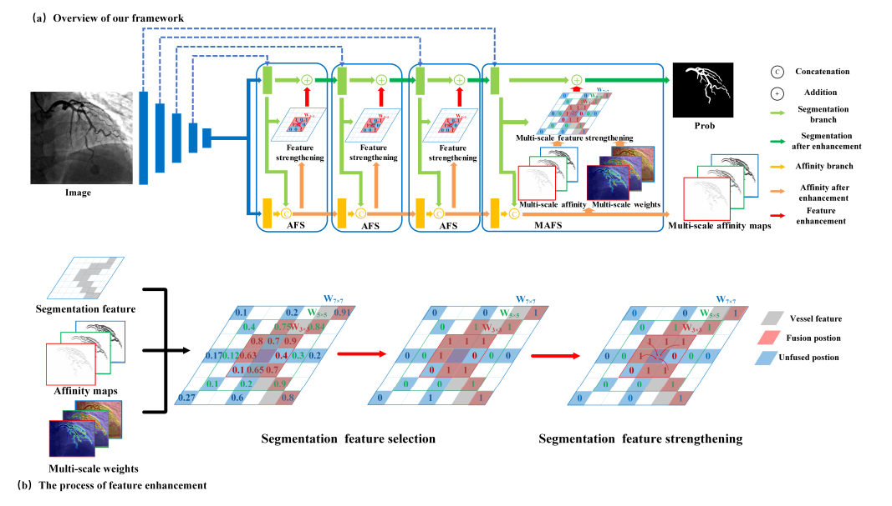

# AFN-3D

This repository contains **AFN-3D**, a 3D extension of the **Affinity Feature Strengthening Network (AFN)** designed for volumetric segmentation tasks. The implementation was developed specifically for the **Vesuvius Scroll Detection Challenge 2025**.

All relevant code is located in the `models/` directory. Architecturally and conceptually, this work follows the same core principles as the original AFN paper:  
**[Affinity Feature Strengthening for Accurate, Complete and Robust Vessel Segmentation](https://arxiv.org/pdf/2211.06578)**, adapted carefully to the 3D setting.



---

## Key Design Differences from the Original AFN Implementation

While preserving the original AFN logic, this implementation introduces several deliberate modifications to improve flexibility and enable systematic experimentation:

- **Modular, research-friendly design**  
  The architecture is decomposed into clean building blocks so that:
  - the number of UAFS blocks can be varied,
  - input resolutions can be changed easily,
  - different encoders can be plugged in without refactoring core logic.

- **Fixed (learnable) scale weights**  
  Unlike the original paper, where scale weights depend on the input features, this implementation uses **learnable but input-independent weights** for scale fusion.

- **No gated skip-connection merging**  
  The gated merging of skip connections into the segmentation stream (used by the original authors) has been removed for simplicity and stability. The overall topology-aware behavior remains intact.

---

## Core Building Blocks

The implementation is structured around three main components, demonstrated clearly in the provided demo notebook.

### 1. Encoder
- Responsible for feature extraction.
- Must return feature maps at the required resolutions for downstream UAFS / MAFS blocks.
- Any encoder that satisfies this interface can be used.

### 2. UAFS (Unary Affinity Feature Strengthening) Block
Each UAFS block takes:
- `x_s`: segmentation stream features,
- `x_t`: affinity stream features from the previous block,
- `r_f`: skip-connection features from the encoder.

It outputs updated `(x_s, x_t)` for the next stage.  
These blocks iteratively strengthen segmentation features using learned affinity-based topology cues.

### 3. MAFS (Multi-scale Affinity Feature Strengthening) Block
- Operates at the final stage.
- Does **not** consume skip-connection features in the current implementation (though this can be added trivially).
- Outputs:
  - the final segmentation prediction,
  - affinity predictions at multiple scales.

**Note** - Keep the UNet Like structure Symmetrical (Same Depth,Height and Width at the same level) because I have coded everything with that in mind, Else you can simply add a interpolation in the UAFS blocks to match dimensions.


---

## Usage Notes

- Refer to the **demo notebook** for a minimal, end-to-end example of how to assemble a full AFN-3D model using these components.
- For conceptual understanding of UAFS and MAFS, please consult the original AFN paper linked above.

---

## Reference

```bibtex
@ARTICLE{10122604,
  author  = {Shi, Tianyi and Ding, Xiaohuan and Zhou, Wei and Pan, Feng and Yan, Zengqiang and Bai, Xiang and Yang, Xin},
  journal = {IEEE Journal of Biomedical and Health Informatics},
  title   = {Affinity Feature Strengthening for Accurate, Complete and Robust Vessel Segmentation},
  year    = {2023},
  pages   = {1--12},
  doi     = {10.1109/JBHI.2023.3274789}
}
